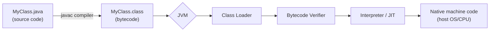
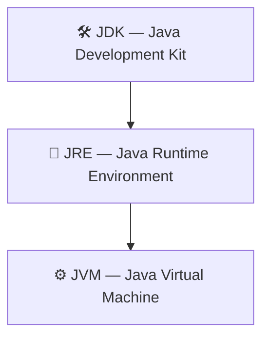
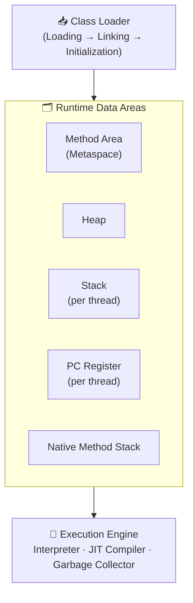

<div align="center">

# ☕ Java Foundations — From Scratch to Advanced
### Topics 1–4: Core Concepts


*Rebuilding Java fundamentals with interview-level depth — not just syntax, but the "why" behind it.*

</div>

<br>

## 📑 Table of Contents
- [1. Introduction to Java](#-1-introduction-to-java)
- [2. JVM, JDK, JRE, JSE vs JEE vs JME](#-2-jvm-jdk-jre-jse-vs-jee-vs-jme)
- [3. Variables, Data Types, Identifiers, Literals, Keywords](#-3-variables-data-types-identifiers-literals-keywords)
- [4. How Java Stores Negative & Floating-Point Numbers](#-4-how-java-stores-negative--floating-point-numbers)

<br>

---

<br>

## ☕ 1. Introduction to Java

> **TL;DR:** Java compiles to platform-neutral *bytecode*, which the JVM then runs on
> any machine. That's the entire idea behind "Write Once, Run Anywhere."

### What is Java?

Java is a high-level, class-based, object-oriented, platform-independent language,
originally released by Sun Microsystems in 1995 (now owned by Oracle). It was
originally named **Oak**, created by **James Gosling** and team.

> 💡 **Why Java exists:** Before Java, C/C++ programs compiled directly to
> machine code specific to one OS/CPU — *compile once, run only there.* Java added
> an intermediate layer (bytecode + JVM) so the same compiled file runs anywhere.

<br>

### 🧩 Key Features (don't just recite these — know the mechanism behind each)

| Feature | What's actually happening under the hood |
|---|---|
| 🌍 **Platform Independent** | `.java` → bytecode (`.class`) → interpreted/JIT-compiled per platform |
| 🧱 **Object-Oriented** | Encapsulation, inheritance, polymorphism, abstraction — everything (except primitives) is an object |
| ✨ **Simple** | No pointers, automatic garbage collection, no operator overloading |
| 🔒 **Secure** | No raw pointers, bytecode verification, class loader sandboxing |
| 💪 **Robust** | Strong compile-time checks + runtime exception handling + auto memory management |
| 🧵 **Multithreaded** | Native support via `Thread`, `Runnable`, `java.util.concurrent` |
| 📦 **Architecture-Neutral** | `int` is *always* 4 bytes, on every OS — no platform-dependent sizes |
| ⚡ **High Performance** | JIT compiler converts "hot" bytecode into native machine code at runtime |
| 🌐 **Distributed** | Built-in networking (`java.net`, RMI, sockets) |
| 🔄 **Dynamic** | Classes load on demand at runtime |

<br>

### 🔁 Compilation & Execution Flow



- `javac` → compiles `.java` source into `.class` bytecode
- Bytecode is **not** native machine code — it's platform-neutral
- The JVM interprets/JIT-compiles that bytecode into instructions the actual CPU understands

<br>

### ⚔️ Java vs C++

| Aspect | ☕ Java | ⚙️ C++ |
|---|---|---|
| Platform dependency | Independent (bytecode + JVM) | Dependent (native compile) |
| Pointers | None (explicit) | Explicit |
| Memory management | Automatic (GC) | Manual (`new`/`delete`) |
| Multiple inheritance | Not for classes (via interfaces only) | Supported |
| Operator overloading | Not supported | Supported |

<br>

### 🏢 Where Java Is Used Today
`Enterprise backend (Spring Boot)` · `Android` · `Big data (Hadoop/Kafka/Spark)` · `Fintech/trading systems` · `Large-scale distributed systems (Amazon, Google, LinkedIn, Netflix)`

<br>

<details>
<summary>🎯 <b>Interview Questions — click to expand</b></summary>
<br>

1. What does "Write Once, Run Anywhere" actually mean *mechanically*?
2. Is Java 100% object-oriented? *(Trick: no — primitives like `int`/`boolean` aren't objects, which is why wrapper classes exist)*
3. Why is Java considered more "secure" than C/C++?
4. What's the difference between compilation in Java vs C++?
5. Name 3 features of Java and explain the mechanism behind each — not just the buzzword.

</details>

<br>

---

<br>

## 🏗️ 2. JVM, JDK, JRE, JSE vs JEE vs JME

> **TL;DR:** `JDK ⊃ JRE ⊃ JVM`. Each one contains the one before it, plus more.
> This gets asked in *every* Java interview — know it at the memory-architecture level, not just the acronym level.

### 📦 The Containment Relationship



<br>

### ⚙️ JVM Architecture (be ready to draw this from memory)



| Component | What it stores | Shared or per-thread? |
|---|---|---|
| **Method Area** (Metaspace) | Class structure, method data, static variables, constant pool | Shared |
| **Heap** | All objects & instance variables — GC operates here | Shared |
| **Stack** | Stack frames (local vars, operand stack) — one frame per method call | Per-thread |
| **PC Register** | Address of the currently executing instruction | Per-thread |
| **Native Method Stack** | Supports native (JNI/C++) calls | Per-thread |

> 💡 **Why this matters:** local variables are thread-safe *by default* because each
> thread gets its own Stack — nobody else can touch your frame.

**Execution Engine breakdown:**
- 🐢 **Interpreter** — reads bytecode line by line, every time (slow for repeated code)
- ⚡ **JIT Compiler** — detects "hot" methods and compiles them straight to native machine code, caches the result
- 🗑️ **Garbage Collector** — reclaims unreachable objects from the Heap

<br>

### 🪆 JRE vs JDK

| | Contains | Who needs it |
|---|---|---|
| **JRE** | JVM + core libraries (`java.lang`, `java.util`, etc.) | End users just *running* Java apps |
| **JDK** | JRE + `javac`, `java`, `javadoc`, `jar`, `jdb`, `jshell` | **You** — developers always install the JDK |

<br>

### 🌐 JSE vs JEE vs JME

> ⚠️ Don't confuse this with JVM/JRE/JDK above — this is about *editions* of Java for different deployment targets.

| Edition | Full Name | Purpose |
|---|---|---|
| ☕ **JSE** | Java Standard Edition | Core language, collections, I/O, networking, threading — what you're learning now |
| 🏢 **JEE** *(now Jakarta EE)* | Java Enterprise Edition | Adds Servlets, JSP, EJB, JPA, JMS — Spring Boot largely replaces this today |
| 📟 **JME** | Java Micro Edition | For resource-constrained/embedded devices — mostly legacy now |

`JME ⊂ JSE ⊂ JEE`

<br>

<details>
<summary>🎯 <b>Interview Questions — click to expand</b></summary>
<br>

1. Is the JVM itself platform-independent? *(Trick: no — JVM implementations are platform-specific; the bytecode is what's portable)*
2. Difference between Method Area and Heap?
3. Why does each thread get its own Stack + PC Register, but share the Heap?
4. Walk through class loading: Loading → Linking → Initialization.
5. Interpreter vs JIT compiler — what's the actual difference?
6. To just run a `.jar` on a server, do you need JDK or JRE?

</details>

<br>

---

<br>

## 🔤 3. Variables, Data Types, Identifiers, Literals, Keywords

### 📌 Variables — by Scope & Lifetime

| Type | Declared | Default value? | Lives where |
|---|---|---|---|
| **Local** | Inside a method/block | ❌ None — must initialize before use | Stack (method call duration) |
| **Instance** | Class-level, non-static | ✅ Yes | Heap (object lifetime) |
| **Static** | Class-level, `static` | ✅ Yes | Method Area (shared across *all* objects) |

```java
class Demo {
    static int staticVar;   // one copy shared by every object
    int instanceVar;        // one copy per object

    void method() {
        int localVar = 10;  // must be initialized — no default
    }
}
```

<br>

### 🔢 Primitive Data Types — memorize this table cold

| Type | Size | Range | Default | Wrapper |
|---|---|---|---|---|
| `byte` | 1 byte | -128 to 127 | `0` | `Byte` |
| `short` | 2 bytes | -32,768 to 32,767 | `0` | `Short` |
| `int` | 4 bytes | ±2.1 billion | `0` | `Integer` |
| `long` | 8 bytes | ±9.2 × 10¹⁸ | `0L` | `Long` |
| `float` | 4 bytes | IEEE 754 single (~6-7 digit precision) | `0.0f` | `Float` |
| `double` | 8 bytes | IEEE 754 double (~15-16 digit precision) | `0.0d` | `Double` |
| `char` | 2 bytes | 0 to 65,535 (Unicode) | `'\u0000'` | `Character` |
| `boolean` | ~1 bit | `true` / `false` | `false` | `Boolean` |

> 💡 Sizes are **fixed by the Java spec**, regardless of OS/CPU — part of what makes Java portable (unlike C, where `int` size can vary by platform).

**Reference types** (classes, arrays, `String`, interfaces, enums) store an *address* to
Heap data, not the value itself. Default is `null`.

```java
int x = 10;                       // stack holds 10 directly
String s = new String("hi");      // stack holds an address; object lives on heap
```

<br>

### 🏷️ Identifier Rules
✅ Letters, digits, `_`, `$` &nbsp;&nbsp;|&nbsp;&nbsp; ❌ Can't start with a digit &nbsp;&nbsp;|&nbsp;&nbsp; ❌ Can't be a keyword &nbsp;&nbsp;|&nbsp;&nbsp; 🔠 Case-sensitive

| Element | Convention | Example |
|---|---|---|
| Class/Interface | PascalCase | `OrderService` |
| Method/Variable | camelCase | `calculateTotal` |
| Constant | UPPER_SNAKE_CASE | `MAX_RETRY_COUNT` |
| Package | lowercase | `com.rahul.orders` |

<br>

### 📝 Literals

| Type | Examples | Notes |
|---|---|---|
| Integer | `10`, `0x1F`, `010`, `0b1010` | Default `int`; `L` suffix for `long` |
| Floating-point | `3.14`, `2.5f` | Default `double`; `f` suffix for `float` |
| Character | `'A'`, `'\n'`, `'\u0041'` | Escape sequences & unicode allowed |
| String | `"Hello"` | Lives in the String Constant Pool |
| Boolean | `true`, `false` | — |
| Null | `null` | Reference types only |

```java
int million = 1_000_000;                    // underscores for readability (Java 7+)
long cardNumber = 1234_5678_9012_3456L;
```

<br>

### 🔑 Keywords (grouped for recall, not rote memorization)

| Category | Keywords |
|---|---|
| Data types | `byte short int long float double char boolean void` |
| Access modifiers | `public private protected` |
| Class/Object | `class interface extends implements new instanceof package import` |
| Modifiers | `static final abstract synchronized transient volatile native strictfp` |
| Flow control | `if else switch case default for while do break continue return` |
| Exceptions | `try catch finally throw throws` |

> ⚠️ **Gotcha:** `true`, `false`, and `null` are **literals**, not keywords. Also,
> `const` and `goto` are reserved but unused.

<br>

<details>
<summary>🎯 <b>Interview Questions — click to expand</b></summary>
<br>

1. Local vs instance vs static variable — memory area + default values for each?
2. Why does Java have both primitives *and* wrapper classes?
3. Default value of an uninitialized local variable? *(Trick: none — compile error)*
4. Are `true`/`false`/`null` keywords? *(No — literals)*
5. Size of `int` on 32-bit vs 64-bit machine? *(Trick: always 4 bytes)*
6. Can an identifier start with `$` or `_`? *(Yes, though unconventional)*

</details>

<br>

---

<br>

## 🔢 4. How Java Stores Negative & Floating-Point Numbers

> **TL;DR:** Integers use **Two's Complement**. Floats/doubles use **IEEE 754**.
> Two completely different systems — know both, and know *why* they're different.

### ➖ Two's Complement (Negative Integers)

Java has **no `unsigned` keyword** — every integer type is signed, using two's complement.

**Why not sign + magnitude?** It creates two zeros (+0/-0) and needs separate circuits
for addition vs subtraction. Two's complement fixes both.

**How to compute it** (for `-x` in `n` bits):
1. Write `x` in binary
2. Flip every bit (one's complement)
3. Add 1

```
Step 1:  5  →  00000101
Step 2:  invert → 11111010
Step 3:  +1      → 11111011   ← this is -5 (8-bit)
```
Verify: `-128 + 64+32+16+8+2+1 = -5` ✔️

| Why it's elegant | |
|---|---|
| ✅ Only one zero | `00000000` |
| ✅ Same circuit for +/− | `a - b = a + twos_complement(b)` |
| ✅ Sign readable from MSB | `0` = positive, `1` = negative |
| ⚠️ Asymmetric range | `byte`: -128 to 127 — one extra negative, no positive match |

> 💡 That asymmetry is *why* `Math.abs(Byte.MIN_VALUE)` famously overflows back to `-128` in Java.

<br>

### 🌊 IEEE 754 (Floating-Point Numbers)

```
value = (-1)^sign × 1.mantissa × 2^(exponent - bias)
```

| Type | Total bits | Sign | Exponent | Mantissa | Bias |
|---|---|---|---|---|---|
| `float` | 32 | 1 | 8 | 23 | 127 |
| `double` | 64 | 1 | 11 | 52 | 1023 |

**Worked example — `5.75` as a float:**
```
5.75 → binary 101.11 → normalized: 1.0111 × 2²

sign     = 0
exponent = 2 + 127 = 129 = 10000001
mantissa = 0111000000000000000000

Final: 0 10000001 01110000000000000000000
```

> ⚠️ **Why `0.1 + 0.2 != 0.3`:** most decimal fractions can't be represented exactly
> in binary — same reason `1/3` has no exact decimal form. This is *not* a Java bug;
> it happens in nearly every mainstream language.

```java
System.out.println(0.1 + 0.2);   // 0.30000000000000004
```

> 💰 **Practical rule:** never use `float`/`double` for money. Use `BigDecimal`
> (stores an unscaled integer + scale — no binary approximation). Worth double-checking
> your Order Management System project uses `BigDecimal` for prices, not `double`.

<br>

### ⚖️ Integer vs Floating-Point Storage

| | Integers | Floats/Doubles |
|---|---|---|
| Standard | Two's Complement | IEEE 754 |
| Precision | Exact (in range) | Approximate |
| Structure | Pure binary + implied sign | Sign + Exponent + Mantissa |
| Overflow | Silently wraps around | Becomes `Infinity`/`NaN` |

<br>

<details>
<summary>🎯 <b>Interview Questions — click to expand</b></summary>
<br>

1. Why two's complement instead of sign-magnitude?
2. Why is `|Integer.MIN_VALUE|` one more than `Integer.MAX_VALUE`?
3. Why does `0.1 + 0.2 != 0.3` in Java?
4. What should you use instead of `double` for currency, and why?
5. Convert `-5` to 8-bit two's complement by hand.
6. What do sign / exponent / mantissa represent in IEEE 754?

</details>

<br>

---

<div align="center">

*Part of a structured Java foundations series — more topics (OOP, Collections, Exceptions, Multithreading, Java 8+, Design Patterns) coming as the series continues.*

</div>
